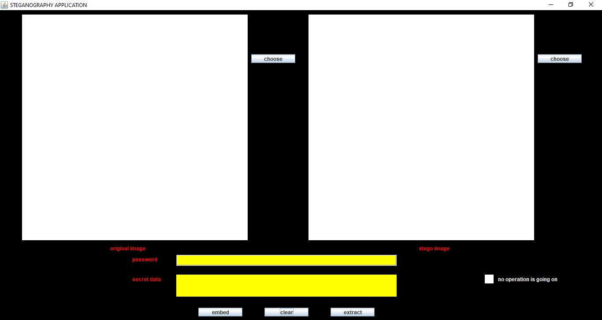
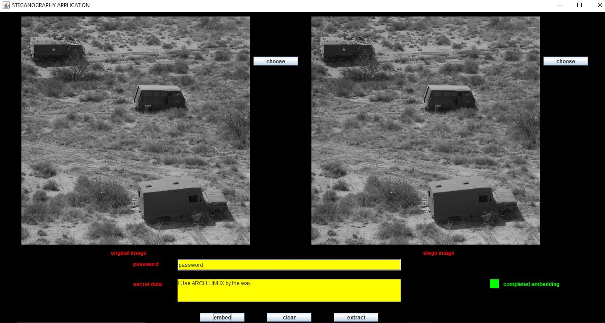
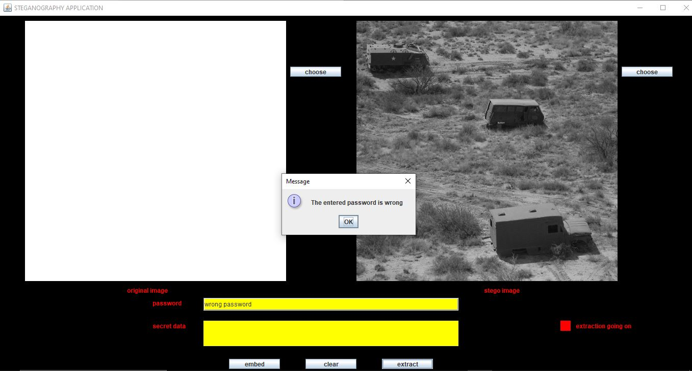
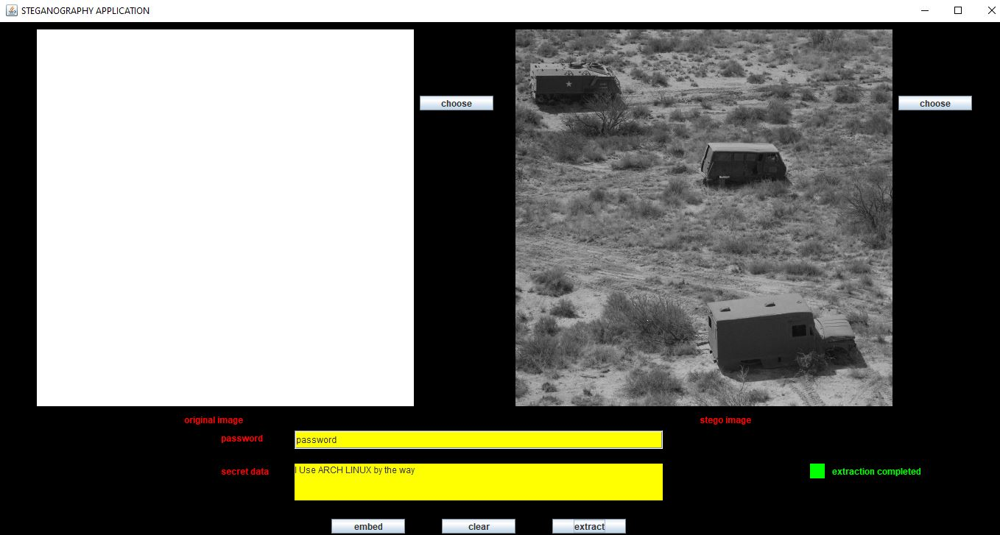

# Image-Steganography-using-AES-ecnryption-and-LSB-encoding-method

This application is a image steganography tool that can be used to embed text into images without compromising on the quality of the image.This tool can embed text into black and white PNG images 
after encrypting the normal text using AES-256 bit encryption algorithm.The tool can also retrieve text from B/W PNG images which are embedding using the same tool.

## Software needed to run this tool
1. Install java (>=8 version).
2. either clone this repository or download this repository as ZIP file and unzip it.

## Features of this Steganography tool

1. Uses password to generate the key used to perform encryption.
2. Uses AES 256 bit algorithm to encrypt the entered text into plain text.
3. Allows user to select desired png image and displays it
4. Shows the current status of the tool like NO OPERATION GOING ON,EMBEDDING,COMPLTED EMBEDDING,OPERATION FAILED etc
5. Allows user to enter the text that has to be embedded into the image.
6. Displays the image that contains encrypted text to user so the user can view the resulting picture quality.
7. Can retrieve encrypted text embedded in image,decrypt it and show it to the user(if the user has entered the password correctly).

## Interface explanation

1. In the "password" text field enter the password.
2. In the "secret data" text area enter the text that has to be embedded into the image.
3. Click on "embed" button to start embedding of encrypted text into image.
4. In the "original image" and "stego image" panels you can see original and image after embedding respectively.
5. Clicking "choose" on either of panels will open a File chooser that allows user to select files.
6. Clicking "extract" image to extract text from image displayed in "stego image" panel and the retrieved information would be displayed in "secret data" text area.
7. The small colored panel on the bottom right side will show the status of tool in intutive colors.

## How to start the application

1. Open the terminal in folder having all java files present in this repo.
2. compile the "Stegano_GUI.java" file by entering "javac Stegano_GUI.java".
3. Start the appliccation by entering "java Stegano_GUI" in the terminal.
4. After that the application starts.
   
## How to embed text into image

1. Enter the password into "password" text field.
2. Enter the text that has to be embedded in "secret data" text area.
3. click on "choose" button present which is to right of "original image" panel,this will open a file chooser select the desired file for holding text.
4. click on "embed" button to embed the text into the image.
5. Wait untill the status panel shows "completed embedding".
6. The resulting image would be stored in the same directory where these java codes are present.
7. Also the resulting image would be displayed in the "stego image" panel as shown below.
8. 

## How to clear the current selected image

1. Just click on "clear" button.

## How to extract the text from image

1. In the "password" field enter the password.
2. Click "choose" button present at right to the "stego image" panel.
3. Select the image which is holding text.
4. Click on "Extract" button which is present at bottom.
5. If the password is incorrect.It displays the same as shown below.
   

7. Wait until the status changes to "extraction completed".
8. The secret text will be displayed in the "secret data" text area as shown below.
   
    
